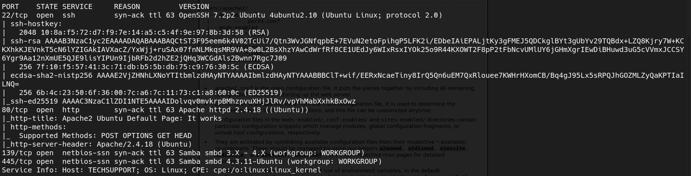
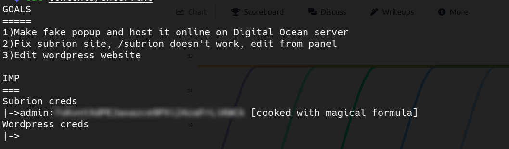
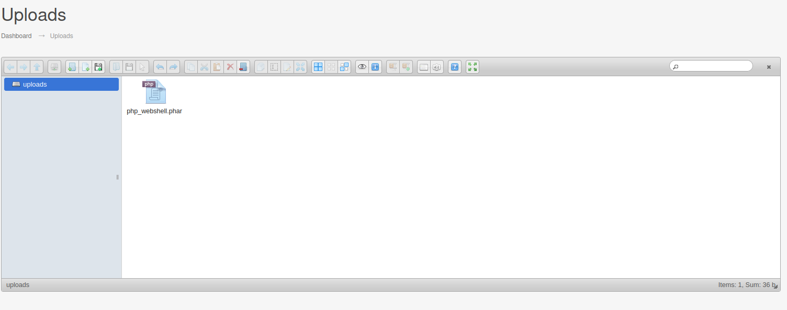
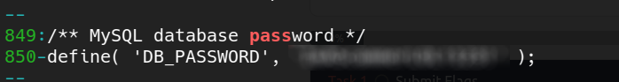
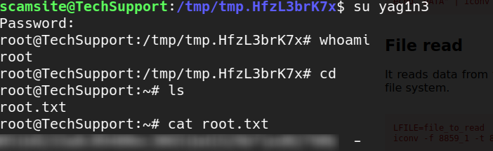

# Tech Supp0rt: 1 Walkthough (Tryhackme) - by [yag1n3](https://www.github.com/yaguine)  

--- 

## Basic Machine Info

### objetives 
* root flag

### room labels
* RCE
* file upload
* sudo
* custom

---

## Access as www-data

### nmap 

  

### samba

with enum4linux i see an interesting share that is accesible without password  
`smbclient //$target/websrv -N` to access it  
it contains the file *enter.txt*  

  

we see some creds that are meant to work on the */subrion* subdirectory  
after applying Base58, Base32 and Base64 to the encoded we have a clear-text password  

### website

we are greeted by the default Apache page  
trying */subrion*, it redirects us to a internal IP so it doesn't work  
with web fuzzing, we also discover */test* and */wordpress*  

looks like this scammer have this web server organized to store multiple websites  
the */test* site doesn't look interesting at all  
the */wordpress* site doesn't look vulnerable after using **wpscan**, but we retrieve the user *support*  

searching about **Subrion CMS**, we discover that the regular route for the admin panel is *<website>/panel*  
so we try *http://<ip>/subrion/panel* and we see the admin panel for **Subrion CMS v4.2.1**  
we get in with the previous discovered credentials  

we google about this version of the CMS, and it looks that it allows uploading a WebShell, therefore leading to RCE  
[this is the exploit](https://www.exploit-db.com/exploits/49876)  

i am not able to make it work, but checking the code im able to acomplish the same in a more manual way  

1. We go to the path *http://<ip>/subrion/panel/uploads*  
1. We upload a simple php Webshell, but ending in *.phar* instead  
  
1. Now we remove the */panel* part of our url and add the name of our webshell at the end (http://<ip>/subrion/uploads/php\_webshell.phar)  
1. On this page, we achieve RCE adding the url parameter *?cmd=<command>*

we get a shell as *www-data* !!!

---

## Horizontal Scalation

there is a user called "scamsite", so probably we have to control that user before getting a shell as "root"  
since the wordpress site hasn't been used, i have the idea that the folder of that website might contain the password  

we go to */var/www/html/wordpress*  
we search for files containing the word "pass" with the command `cat * | grep -A 1 -n -i "pass"`  
there we go !  

  

that password is stored in *wp-config.php*  
we try it for the user "scamsite" and it works !!!  

---

## Shell as Root

this one is pretty straightforward  
with `sudo -l` we see that we can use the binary */usr/bin/iconv* as root  
this binary has [a page on GTFOBins](https://gtfobins.github.io/gtfobins/iconv/)  
it will allow us to either write or read files, but im going to use it to write */etc/passwd* to get a root user  

1. we create a temporary folder on */tmp* with `mktemp -d`  
1. on that temporary folder, we create a copy of */etc/passwd* with `cp /etc/passwd ./passwd_copy`  
1. we create a valid hash (it can be in your machine) with `openssl passwd -1 -salt <salt> <password>`  
1. you add the following line to the end of your *passwd\_copy* file `<username>:<hash>:0:0:yag1n3:/root:/bin/bash`  
1. `cat passwd_copy | sudo /usr/bin/iconv -f 8859_1 -t 8859_1 -o /etc/passwd`  
1. now your copy is on the */etc/passwd* location, and you can enter as your selected username and password

  

There you have your Root Flag !!
